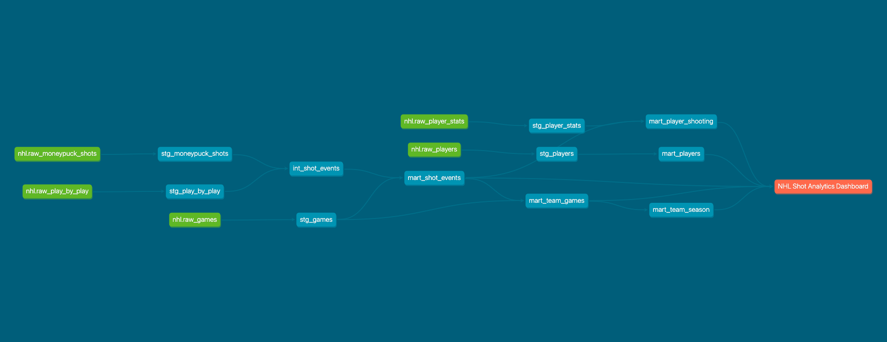

# NHL Shot Analytics

This project ingests NHL play-by-play, rosters, and shot data from the NHL API and MoneyPuck, models it with dbt, and serves an interactive Streamlit dashboard with team rolling-metric views and player shot maps with click-to-watch goal videos. Built as an ELT pipeline using Python, DuckDB/MotherDuck, and dbt.

## Pipeline


## Background

```
NHL API + MoneyPuck → Python Extract → DuckDB / MotherDuck → dbt Transform → Streamlit Dashboard
```

The pipeline runs daily at 07:00 UTC via GitHub Actions. Each run pulls finished games, play-by-play events, rosters, and skater stats from the public [NHL API](https://api-web.nhle.com/), then joins the play-by-play to MoneyPuck shot data (which provides pre-computed expected goals values) before running `dbt build`. The warehouse is MotherDuck in production with a local DuckDB fallback for development.

## Dataset

[X] shot events across [X] games covering the [2023-24], [2024-25], and current [2025-26] NHL seasons, with rosters and skater stats for [X] active players. Each shot event includes shooter, location, distance, angle, strength state, and an xG value joined from MoneyPuck.

## dbt Models

**Staging** (views, 1:1 with raw)
- `stg_games` — cleaned game schedule with derived `game_outcome` and `home_win`
- `stg_play_by_play` — typed play-by-play events
- `stg_moneypuck_shots` — MoneyPuck shots renamed to NHL conventions
- `stg_players` — rosters with derived `full_name` and team logo URL
- `stg_player_stats` — skater season totals

**Intermediate** (view)
- `int_shot_events` — deduplicates MoneyPuck, parses situation codes into strength state (5v5, PP, PK, etc.), computes shot distance and angle from x/y coordinates

**Marts** (tables)
- `mart_shot_events` — one row per shot with shooter, game context, geometry, and xG
- `mart_player_shooting` — one row per player per season with shot totals, xG, points, and league percentile ranks

**Tests**
- `not_null`, `unique`, and `accepted_values` on key columns across all layers
- `dbt_utils.unique_combination_of_columns` on composite keys
- Custom singular tests validating team season SH% falls in 7–16% and SV% in realistic ranges

## dbt Lineage



## Dashboard

[Live Dashboard](https://nhl-shot-analytics.streamlit.app/)

Browse any team to see a rolling xG / shots / save% game log, win-loss streak grid, and full roster. Click a player to open a player card with season percentile rankings vs. the league and a shot map rendered on a real rink. Click any goal dot on the shot map to watch the highlight video inline.

## Instructions to Run Locally

Download the prebuilt DuckDB database from the [Releases page](https://github.com/bobby-king3/nhl-shot-analytics/releases) and place it in the `data/` folder. No API key or MotherDuck account is needed to run dbt or the dashboard locally.

```bash
git clone https://github.com/bobby-king3/nhl-shot-analytics.git
cd nhl-shot-analytics

python3 -m venv venv
source venv/bin/activate
pip install -r requirements.txt
```

> **Note:** dbt requires a profile in `~/.dbt/profiles.yml`. Add the following entry before running `dbt build`:
> ```yaml
> nhl_shot_intelligence:
>   target: dev
>   outputs:
>     dev:
>       type: duckdb
>       path: /path/to/nhl-shot-analytics/data/nhl.duckdb
> ```

```bash
cd transform/dbt_project
dbt deps
dbt build

cd ../..
streamlit run dashboard/app.py
```

## Running the Full Pipeline

The NHL API is public and requires no key. To pull fresh data end-to-end:

```bash
# From the project root
python -m extract.pipeline
```

This runs all extractors (games, play-by-play, rosters, skater stats), then `dbt deps && dbt run && dbt test`. Set `MOTHERDUCK_TOKEN` in `.env` to write to the cloud warehouse; otherwise the pipeline writes to `data/nhl.duckdb`.

For goal-video playback in the dashboard, set `ACCOUNT_ID` and `POLICY_KEY` in `.env` for the Brightcove Playback API.

## Planned Future Work
- Automate the MoneyPuck shot ingest (currently a manual CSV → parquet → MotherDuck step) so xG values land in the warehouse on the same daily cadence as the NHL API data.
- Add a goalie analytics page (save% by zone, high-danger save rate).
- Add a team-vs-team comparison view.
- Move the heaviest dashboard SQL into dbt marts and expose them via dbt `exposures` for full lineage coverage.

## Data Sources

- [NHL API](https://api-web.nhle.com/) — schedule, play-by-play, rosters, stats. Public, no auth.
- [MoneyPuck](https://moneypuck.com/) — open shot data with pre-computed xG.
- Brightcove Playback API — resolves NHL goal-clip video URLs for the dashboard's click-to-watch feature.
