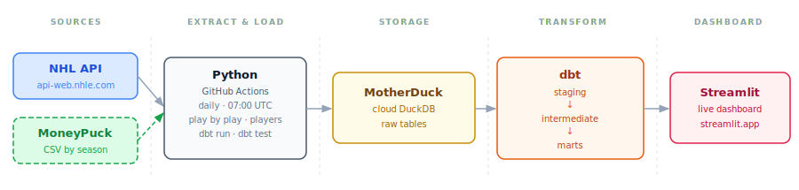
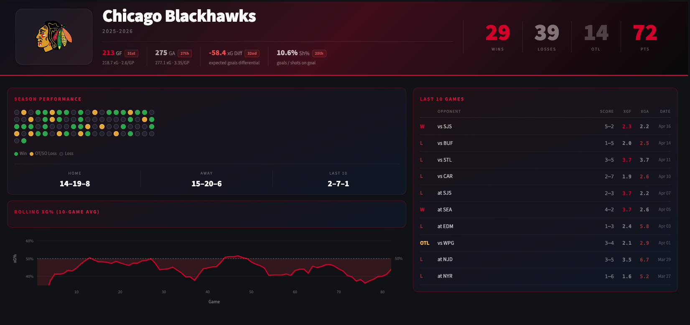
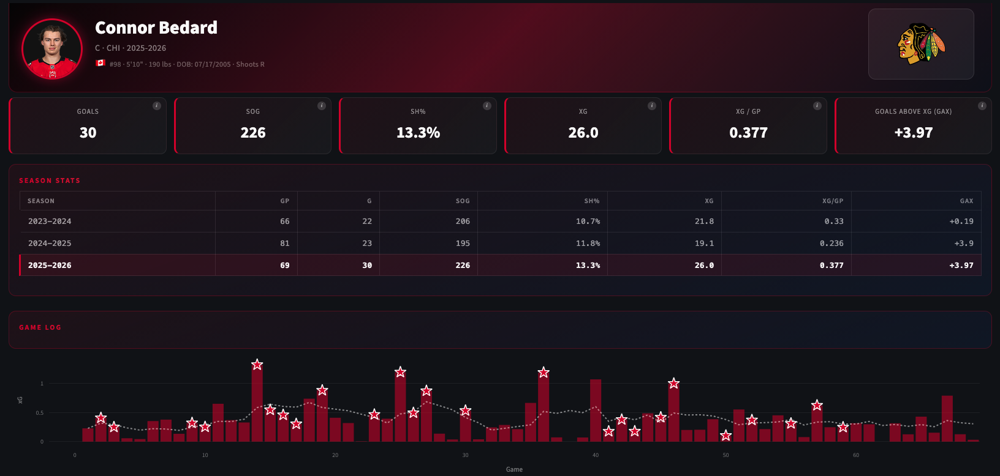
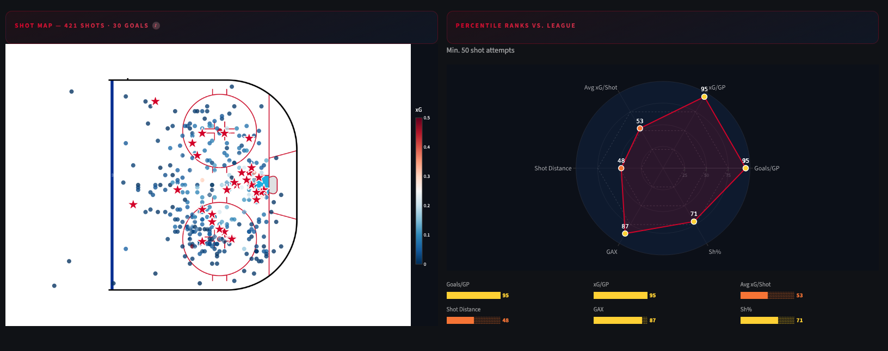

# NHL Shot Analytics

This project builds a cloud ELT pipeline for NHL shot analytics using Python, MotherDuck, dbt, and Streamlit. It combines NHL API play-by-play, roster, schedule, and skater data with MoneyPuck expected goals data to power team and player analysis across the league.

[Live Dashboard](https://nhl-shot-analytics.streamlit.app/)

## Pipeline

## Project Summary

The pipeline runs daily at 07:00 UTC with GitHub Actions. Each run pulls newly finished games from the public [NHL API](https://api-web.nhle.com/), loads the data into MotherDuck, and rebuilds the dbt models used by the dashboard.

MoneyPuck is a hockey analytics site that publishes shot-level data and models expected goals. This project uses MoneyPuck's public shot files to enrich NHL play-by-play events with xG, rush shot, and rebound shot fields.

The modeled shot table covers **355,344 shot attempts** across the 2023-24, 2024-25, and 2025-26 NHL seasons. Each shot is modeled with game context, player/team details, rink location, shot distance and angle, strength state, xG, and goal video links when available.

**NHL API**
- Game schedule, teams, scores, venues, and game outcomes
- Play by play shot events with period, time, shot type, shooter, goalie, team, score state, and highlight links
- Player rosters, headshots, positions, sweater numbers, handedness, height, weight, and birth details
- Season-level skater stats used in player cards and percentile rankings

**MoneyPuck**
- Shot level expected goals values
- Rush shot and rebound shot indicators
- Additional shot context used to enrich the NHL play by play data

## dbt Models

**Staging**
- `stg_games` - cleaned NHL schedule and results
- `stg_play_by_play` - shot-level NHL play-by-play events
- `stg_moneypuck_shots` - MoneyPuck shot data aligned to NHL ids
- `stg_players` - roster and player bio data
- `stg_player_stats` - season-level skater stats

**Intermediate**
- `int_shot_events` - joins NHL events to MoneyPuck xG, parses strength state, and calculates shot geometry

**Marts**
- `mart_shot_events` - one row per shot with context, xG, geometry, and video links
- `mart_player_shooting` - player-season shooting metrics and percentile ranks
- `mart_team_games` - team-game results, goals, shots, xG, and opponent context
- `mart_team_season` - team season records, scoring, xG, shooting percentage, and save percentage
- `mart_players` - player dimension for dashboard filters and profile cards

**Tests**
- Key column `not_null`, `unique`, and `accepted_values` checks
- Composite uniqueness tests on player seasons, team games, and team seasons
- Range checks for xG, percentile fields, periods, shooting percentage, and team records

## Dashboard

The Streamlit app has two main views:

- **Teams** - season record, goals for and against, xG for and against, rolling xG share, shooting percentage, save percentage, recent games, and roster details
- **Players** - player cards, league percentile rankings, shot type breakdowns, game logs, career season tables, rink-based shot maps, and click-to-watch goal videos

**Team View**

**Player Overview**

**Shot Map and Percentiles**

## dbt Lineage

## Future Work

- Build an expected goals model directly integrated in the pipeline.
- Add a goalie analytics page with save percentage by zone and high-danger save rate.
