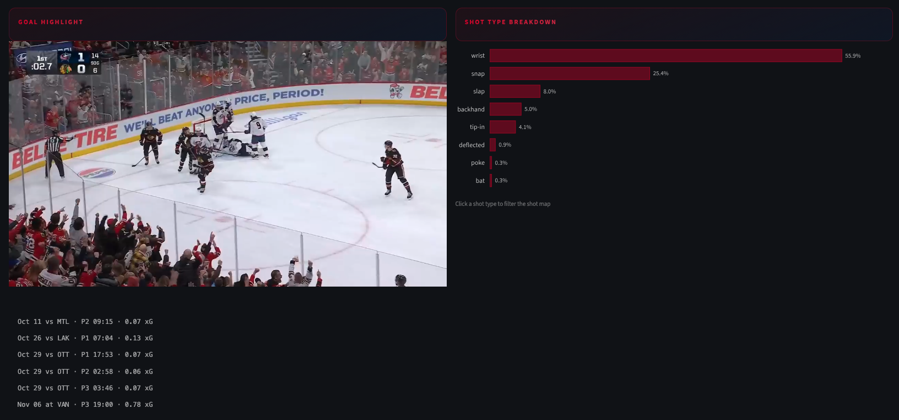

# NHL Shot Analytics

This project builds an ELT pipeline for NHL shot analytics using Python, MotherDuck, dbt, and Streamlit. It combines NHL API play by play, roster, schedule, and skater data with MoneyPuck expected goals metrics to power team and player analysis across the league.

[Streamlit Dashboard](https://nhl-shot-analytics.streamlit.app/)

## Pipeline

## Project Summary

The pipeline runs daily at 07:00 UTC using GitHub Actions. Each run pulls new games from the public [NHL API](https://api-web.nhle.com/), loads the data into MotherDuck, and rebuilds the dbt models used by the dashboard.

MoneyPuck is a hockey analytics site that publishes shot level data and models expected goals. This project uses MoneyPuck's public shot files to add value with xG, rush shot, and rebound shot fields.

The modeled shot table covers the `2023-24`, `2024-25`, and `2025-26` NHL seasons. Each shot is modeled with game context, player/team details, rink location, shot distance and angle, strength state, xG, and goal video links when available.

**NHL API**
- Game schedule, teams, scores, venues, and game outcomes
- Play by play shot events with period, time, shot type, shooter, goalie, team, score state, and highlight links
- Player rosters, headshots, positions, jersey numbers, handedness, height, weight, and birth details
- Season level skater stats used in player cards and percentile rankings

**MoneyPuck**
- Shot level expected goals values
- Rush shot and rebound shot indicators
- Additional shot context used to enrich the NHL play by play data
- [MoneyPuck](https://moneypuck.com/)

## dbt Models

**Staging**
- `stg_games` - cleaned NHL schedule and results
- `stg_play_by_play` - shot level NHL play by play events
- `stg_moneypuck_shots` - MoneyPuck shot data
- `stg_players` - roster and player bio data
- `stg_player_stats` - season level skater stats

**Intermediate**
- `int_shot_events` - joins NHL events to MoneyPuck xG, parses strength state, and calculates shot metrics

**Marts**
- `mart_shot_events` - one row per shot with context, xG, postitions, and video links
- `mart_player_shooting` - player season shooting metrics and percentile ranks
- `mart_team_games` - team game results, goals, shots, xG, and opponent context
- `mart_team_season` - team season records, scoring, xG, and shooting percentages
- `mart_players` - player dimension for dashboard filters and profile cards

**Tests** - utilized dbt tests to ensure pipeline data quality
- Key column `not_null`, `unique`, and `accepted_values` checks
- Uniqueness tests on player seasons, team games, and team seasons
- Range checks for xG, percentile fields, periods, shooting percentage, and team records

## Dashboard

The Streamlit app has two main views:

- **Teams** - season record, goals for and against, xG for and against, rolling xG plot, recent game results, and roster details
- **Players** - player cards, league percentile rankings, shot type breakdowns, game logs, career season tables, interactive shot map, and goal videos

**Team View**

**Player Overview**

**Shot Map and Percentiles**

**Goal Video Playback**

Goal events on the shot map can be selected to watch the available NHL highlight video inline.

## Future Work

- Build an expected goals model trained on NHL play by play data and integrate directly into the pipeline.
- Add a goalie analytics page using all the data made available in this pipeline.
